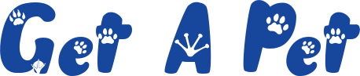

# Django Fullstack Pet Adoption Project

Welcome to Django Fullstack Pet Adoption Project! This application leverages the power of the Django Framework to create a great user experience.

## Overview

This project is designed as a web application, emulating a pet adoption platform. Users can enjoy a range of features, including registration capabilities and the ability to explore and make adoption requests for pets.

## Key Features

- **User Registration:**
  - Register
  - Login / Logout
  - Profile Atualization
- **Pet Adoption Interface:**
  - Adoption request for user
  - Adoption confirm and refuse for pet owners
- **Django Fullstack Implementation:**

## How to Get Started

1. **Clone the Repository:**
   git clone https://github.com/MaraisaFerreira/get_a_pet_DJANGO.git
    
2. **Set Up Virtual Environment:**
   python -m venv env
    
3. **Install Dependencies:**
   pip install -r requirements.txt
    
4. **Run the Application:**
   python manage.py runserver
    
5. **Access the Application:**
   Open your browser and navigate to [http://localhost:8000/](http://localhost:8000/) to explore the pet adoption platform.

## License

This project is licensed under the [MIT License](LICENSE). Feel free to customize and adapt it.
